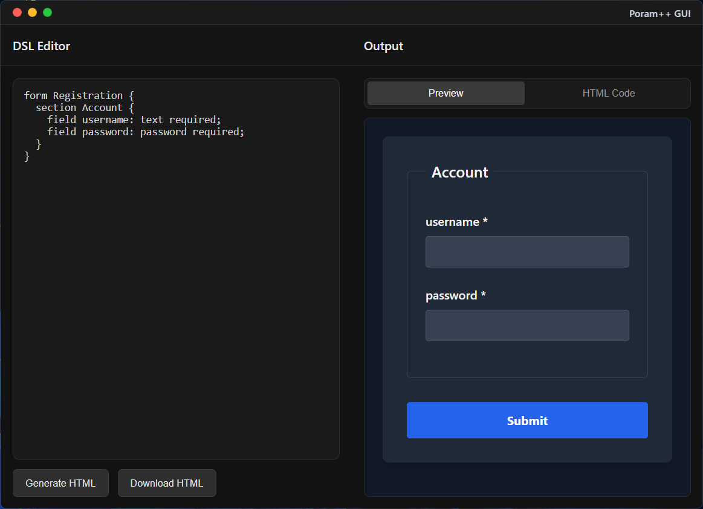

# Poram++ GUI (Tauri)

A lightweight, offline-ready desktop app to visually use the **Poram++ DSL** — built with [Tauri v2](https://tauri.app/), Vite, and TypeScript.

Write your form in DSL → Render live HTML → Preview and export it.

---

## Features

- Live preview of DSL-based form layout
- Uses native Tauri shell (very lightweight)
- HTML output is fully offline and self-contained
- CLI flags passed directly to the DSL binary
- Works on both Windows and Linux

---

## How It Works

This GUI runs your DSL input through the `poram` CLI tool under the hood (compiled from C using Lex/Yacc). The GUI communicates with the binary via stdin/stdout and renders the result in an iframe.

---

## Setup

### Requirements

- Node.js
- Rust + Cargo
- Tauri CLI (`cargo install tauri-cli`)

### Install and run:

```bash
npm install
npm run tauri
```

---

## Project Structure

```
src/             → Frontend UI (TypeScript, HTML, CSS)
src-tauri/       → Tauri app backend (Rust)
bin/             → Place your poram binary here (from poram-pp repo)
```

---

## DSL Binary Required

You must download and place the Poram++ CLI binary inside:

```
./bin/poram    (Linux)
./bin/poram.exe (Windows)
```

Download from the official compiler repo:
**[Poram++ DSL Compiler](https://github.com/NayanthaNethsara/poram-pp/releases)**

---

## Screenshots

> 
> Example: a form DSL input on the left, rendered HTML form on the right

---

## Known Issues

- On Windows, `poram.exe` flashes a console window briefly when executed.

  - You can fix this by building with `-mwindows` instead of `-mconsole`.

- Minor UI layout bugs:
  - No scroll on long preview content
  - Textarea doesn't resize responsively on window resize

## Related Projects

- [Poram++ DSL Compiler (C + Lex/Yacc)](https://github.com/NayanthaNethsara/poram-pp)

---

## License

MIT — see [LICENSE](./LICENSE)
